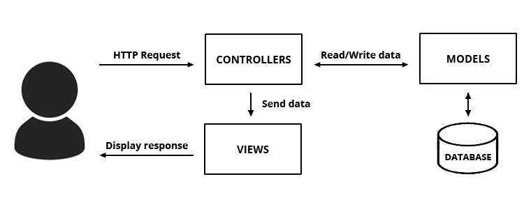

# 02. 스프링부트에서 테스트코드를 작성하자
## 서론
- 대부분의 회사에서 '테스트 코드'에 관한 요구가 늘고있음
- TDD가 아니더라도 꼭 테스트 코드를 작성해야함 ㅇㅇ
## 02.1 테스트 코드 소개
### TDD와 단위테스트의 차이
- TDD: 테스트가 주도하는 개발, 테스트 코드를 먼저 작성함
   - 레드그린 사이클
      1. 항상 실패하는 테스트를 먼저 작성 (RED)
      2. 테스트가 통과하는 프로덕션 코드를 작성 (GREEN)
      3. 테스트가 통과하면 프로덕션 코드를 리팩토링 (REFACTOR)
- 단위 테스트: 순전히 기능 단위의 테스트 코드를 작성, 리펙토링은 포함x
### 단위 테스트 코드를 작성해야 하는 이유
- 개발 초기에 문제를 발견하게 도와줌
- 코드 리팩토링, 라이브러리 업그레이드 등에서 기존 기능의 작동 여부 확인
- 기능에 대한 불확실성을 감소시킴
- 시스템에 대한 실제 문서를 제공 (테스트 자체가 문서로 사용될 수 있음)
- etc.
   - 빠른 피드백
   - 사람이 눈으로 검증안해도됨 (자동검증)
   - 개발자가 만든 기능을 안전하게 보호해줌
### 테스트코드 작성 프레임워크
- xUnit (가장 대중적인 프레임워크)
   - 개발환경(x)에 따라 Unit테스트를 도와주는 친구입니다
      - JUnit, DBUnit, CppUnit, NUnit
   - 이 중, Java용인 JUnit을 사용할거다!!
   - 아직 JUnit4가 5보다 대중적임 ㅇㅇ (2021에는 어떨까?)

## 02.2 Hello Controller 테스트 코드 작성하기
### 프로젝트의 시작, Application 클래스
1. `현재 프로젝트 > src > main > java` 에서 패키지 생성하기
   - 일반적인 패키지 명은 '웹사이트 주소의 역순'으로 작성함
   - 여기서는 Group Id인 `com.chlee.www`에 springboot를 붙여 사용하도록 하겠음
   - `com.chlee.www.springboot`
2. 패키지 아래에 Java클래스 생성
   - 클래스 이름은 `Application`으로 함
3. `Application`클래스의 코드를 작성
    ~~~java
    // 앞으로 만들 프로젝트의 메인 클래스!!
    package com.chlee.www.springboot;
    
    import org.springframework.boot.SpringApplication;
    import org.springframework.boot.autoconfigure.SpringBootApplication;
    
    //@SpringBootApplication
    //스프링 부트의 자동 설정, 스프링 Bean읽기와 생성을 모두 자동으로 설정해줌
    //이 위치부터 설정을 읽기 때문에, 이 클래스는 프로젝트의 최상단에 위치해야 함
    @SpringBootApplication
    public class Application {
        public static void main(String[] args) {
        //SpringApplication.run
        //내장 WAS를 실행함 (애플리케이션 실행시 내부에서 WAS실행)
        //항상 서버에 톰캣을 설치할 필요가 없고, 스프링부트로 만들어진 Jar파일로 실행하면 됨
        SpringApplication.run(SpringApplication.class, args);
        }
    }
    ~~~
    - 내장 WAS사용시 장점
        - 항상 같은 서버환경을 갖기 때문에 (SpringBoot에 의한 상태관리), 배포가 용이함
    
### Controller 만들기
- Controller가 뭐임?
    - *A controller is **part of the MVC (Model – View – Controller) design pattern.***   
    *The model manages the data, logic and rules of the application.*  
    *The view renders the visual layout for the user, these are basically templates.*  
    ***The controller accepts user requests, interacts with the model and selects the view for response***  
    - 라는 말에 따르면 컨트롤러는 User의 요청을 직접 받으며, 보여줄 데이터를 정리하는 역할을 하는 것 인가보다  
    
1. `현재 프로젝트 > src > main > java > com.chlee.www.springboot`에서 패키지 생성하기
    - 이름은 `web`
    - 컨트롤러에 관련된 클래스는 모두 `web`에 담을 예정
2. `HelloController`라는 이름의 클래스 만들기
3. 클래스 코드 작성  
   - /hello요청이 오면 hello문자열을 반환하는 컨트롤러 작성  
    ~~~java
    //HelloController 생성
    package com.chlee.www.springboot.web;
    
    import org.springframework.web.bind.annotation.GetMapping;
    import org.springframework.web.bind.annotation.RestController;
    
    //@RestController
    //- 컨트롤러를 JSON을 반환하는 컨트롤러로 만들어준다
    //- 예전에는 @ResponseBody를 각 메소드마다 선언했던 것을 한번에 사용할 수 있게 해준것
    @RestController
    public class HelloController {
        //@GetMapping
        //- HTTP Method인 Get의 요청을 받을 수 있는 API를 만들어줌
        //- 예전 @RequestMapping(method = RequestMethod.GET)으로 사용되었음
        //- /hello요청이 오면 문자열 hello를 반환해줌
        @GetMapping("/hello")
        public String hello() {
            return "hello";
        }
    }
    ~~~

### Controller Test 만들기
1. `현재 프로젝트 > src > test > java`에 패키지 생성
    - 이름은 테스트할 클래스가 포함된 패키지와 동일하게 `com.chlee.www.springboot`
2. 테스트코드를 작성할 클래스(테스트 클래스)를 생성
    - 테스트 대상 클래스의 이름에 Test를 붙이면 됨
    - `HelloControllerTest`
3. 클래스에 테스트코드 추가
    ~~~java
    //HelloControllerTest 생성
    package com.chlee.www.springboot;

    import com.chlee.www.springboot.web.HelloController;
    import org.junit.Test;
    import org.junit.runner.RunWith;
    import org.springframework.beans.factory.annotation.Autowired;
    import org.springframework.boot.test.autoconfigure.web.servlet.WebMvcTest;
    import org.springframework.test.context.junit4.SpringRunner;
    import org.springframework.test.web.servlet.MockMvc;
    import org.springframework.test.web.servlet.ResultActions;
    import static org.springframework.test.web.servlet.request.MockMvcRequestBuilders.get;
    import static org.springframework.test.web.servlet.result.MockMvcResultMatchers.content;
    import static org.springframework.test.web.servlet.result.MockMvcResultMatchers.status;
    
    @RunWith(SpringRunner.class) //1
    @WebMvcTest(controllers = HelloController.class) //2
    public class HelloControllerTest {
    
        @Autowired //3
        private MockMvc mvc; //4
    
        @Test
        public void hello가_리턴된다() throws Exception {
            String hello = "hello";
    
            mvc.perform(get("/hello")) //5
                    .andExpect(status().isOk()) //6
                    .andExpect(content().string(hello)); //7
        }
    }
    ~~~
    - 코드 설명
        1. `@RunWith(SpringRunner.class)`
            - 테스트진행시 JUnit내장 실행자 대신 SpringRunner라는 스프링 실행자를 사용
            - 스프링부트 테스트와 JUnit사이의 연결자역할임
        2. `@WebMvcTest`
            - 여러 테스트 어노테이션 중, Web(Spring Mvc)에 집중할 수 있는 어노테이션
            - 선언할 경우 `@Controller`, `@ControllerAdvice`등을 사용할 수 있음
            - 단, `@Service`, `@Component`, `@Repository`등은 사용할 수 없음
            - 우리 코드는 컨트롤러만 사용하기 때문에 선언해도 됨
        3. `@Autowired`
            - 스프링이 관리하는 빈(Bean)을 주입받음
        4. `private MockMvc mvc`
            - 웹 API를 테스트할 때 사용함
            - 스프링 MVC테스트의 시작점
            - 이 클래스를 통해 HTTP GET,POST등에 대한 API테스트를 할 수 있음
        5. `mvc.perform(get("/hello"))`
            - MockMvc를 통해 /hello주소로 HTTP GET요청을 함
            - 체이닝(chaining)이 지원되어 여러 검증기능을 이어서 선언 가능
        6. `.andExpect(status().isOk())`
            - mvc.perform의 결과를 검증함
            - HTTP Header의 Status를 검증함
            - 여기선 200인지 검증
        7. `.andExpect(content().string(hello))`
            - mvc.perform의 결과를 검증함
            - 응답 분문의 내용을 검증함
            - Controller에서 리턴하는게 "hello"인지 검증함
    
### Controller Test 직접 돌려보기
1. 메소드 옆의 초록 화살표 클릭 -> Run 'hello가_리턴된다' 클릭
2. Tests passed 메시지가 뜨면 성공!!
- 수동으로 확인하기 위해선 `Application`에 가서 메소드를 실행해보면 됨
    - 이상한 로고와 함께 로그들이 막 뜨고 중간에 :8080 있으면 성공한거임 ㅇㅇ
    - localhost:8080/hello로 들어가보장

## 02.3 롬복 소개 및 설치하기
: 자바 개발자들의 필.수 라이브러리 롬복*Lombok*
- 자바 개발시 자주 사용되는 Getter, Setter, 기본 생성자, toString등을 어노테이션으로 자동 생성해줌
- eclipse에서는 롬복 설치 힘들지만, IntelliJ에서는 플러그인이 있음  

### 프로젝트에 롬복 추가하기
1. `build.gradle`의 dependencies에 코드 추가
~~~
// 롬복 의존성 추가
complie('org.projectlombok:lombok')
~~~
2. Gradle 새로고침해서 의존성(라이브러리) 내려받기
3. 롬복 플러그인 설치
    - Action > plugins검색 > Marketplace > lombok검색, 설치
    - Restart IDE
4. 롬복에 대한 설정 완료
    - 'Setting > Build > Compiler > Annotation Processors'로 감
    - 'Enable annotation processing'체크
    
\+ 롬복 플러그인은 IDE당 하나만 설치하면되지만, build.gradle수정과 Enable annotation processing 체크는 프로젝트마다 해야 함
### 롬복으로 리팩토링 하기
는 2.4에서 하자

## 02.4 Hello Controller코드를 롬복으로 전환하기
- 사실 코드를 리팩토링하는 것은 쉽지 않음
- 그러나, Test코드가 우리를 지켜주기 때문에 안심하고 돌릴 수 있음 !!
### HelloResponseDto 클래스
- DTO (Data Transfer Object)
1. `web`패키지에 `dto`패키지 추가하기
    - 앞으로 모든 응답 Dto는 `dto`패키지에 추가할 것임
2. `HelloResponseDto`클래스 생성
    ~~~java
    //HelloControllerDto 생성
    package com.chlee.www.springboot.web.dto;

    import lombok.Getter;
    import lombok.RequiredArgsConstructor;
    
    @Getter //1
    @RequiredArgsConstructor //2
    public class HelloResponseDto {
    
        private final String name;
        private final int amount;
    
    }
    ~~~
    - 코드 설명
        1. @Getter
            - 선언된 모든 필드의 get 메소드를 생성
        2. @RequiredArgsConstructor
            - 선언된 모든 final 필드가 포함된 생성자를 생성  
              (final이 없는 필드는 생성자에 포함되지 않음)

### HelloResponseDtoTest 클래스
- test가 잘 돌아간다면, @Getter와 @RequiredArgsConstructor가 잘 작동됨이 증명된 것
1. `현재 프로젝트 > src > test > java > com.chlee.www.springboot`에 `dto`패키지 추가
2. `HelloResponseDtoTest`클래스 추가
    ~~~java
    //HelloControllerDtoTest 생성
    package com.chlee.www.springboot.dto;
    
    import com.chlee.www.springboot.web.dto.HelloResponseDto;
    import org.junit.Test;
    import static org.assertj.core.api.Assertions.assertThat; //3
    
    public class HelloResponseDtoTest {
    
        @Test
        public void 롬복_기능_테스트() {
            //given
            String name = "test";
            int amount = 1000;
    
            //when
            HelloResponseDto dto = new HelloResponseDto(name, amount);
    
            //then
            assertThat(dto.getName()).isEqualTo(name); //1,2
            assertThat(dto.getAmount()).isEqualTo(amount);
        }
    }
    ~~~
    - 코드 설명
        1. assertThat
            - assertj라는 테스트 검증 라이브러리의 검증 메소드
            - 검증하고 싶은 대상을 메소드 인자로 받음
            - 메소드 체이닝 지원 (ex. isEqualTo)
        2. isEqualTo
            - assertj의 동등 비교 메소드
            - assertThat에 있는 값고, isEqualTo의 값을 비교해서 같을 때만 성공
        3. assertj의 assertThat
            - cf) Junit의 기본 assertThat
            - 장점 ([참고영상](http://bit.ly/30vm9Lg))
                1. CoreMatchers와 달리 추가적인 라이브러리가 필요하지 않다  
                   (기본 assertThat을 쓰면, is()와 같은 CoreMatchers라이브러리가 필요)
                2. 자동완성이 더 확실하게 지원됨
                    - IDE에선 Matcher라이브러리의 자동완성 지원이 약함
    
### HelloController가 ResponseDto를 사용하게 만들기
1. `HelloController`에 코드 추가하기  
    ~~~
    //HelloController 업데이트
    @GetMapping("/hello/dto") 
    //- /hello/dto에 get요청이 오면 아래 함수 출력함
    //name과 amount를 받아서 HelloResponseDto객체를 생성하는 함수 
    public HelloResponseDto helloDto(@RequestParam("name") String name, //1
                                     @RequestParam("amount") int amount ) {
        return new HelloResponseDto(name, amount);
    }
    ~~~
    - 코드 설명
        1. @RequestParam
            - 외부에서 API로 넘긴 파라미터를 가져오는 Annotation
            - 여기선 name이란 이름으로 넘긴 파라미터(@RequestParam("name"))를 메소드 파라미터(String name)에 저장하는 문법!
    
2. 추가된 API를 테스트하는 코드를 `HelloControllerTest`에 추가
    ~~~
    //HelloControllerTest 업데이트
    @Test
    public void helloDto가_리턴된다() throws Exception {
        String name = "hello";
        int amount = 1000;
        
        mvc.perform(
                get("/hello/dto")
                    .param("name", name) //1
                    .param("amount", String.valueOf(amount))
        ).andExpect(status().isOk())
         .andExpect(jsonPath("$.name", is(name))) //2
         .andExpect(jsonPath("$.amount", is(amount)));
    }
    ~~~
    - 코드 설명
        1. param
            - API테스트할 때 사용될 요청 파라미터를 설정
            - 단, 값은 string만 허용
            - 따라서 숫자/날짜 등의 데이터도 등록할 때는 문자열로 변경해야함 (String.valueOf함수 이용)
        2. jsonPath
            - JSON응답값을 필드별로 검증할 수 있는 메소드
            - $를 기준으로 필드명 명시
            - 여기선 name과 amount, 즉 $.name, $.amount로 검증함